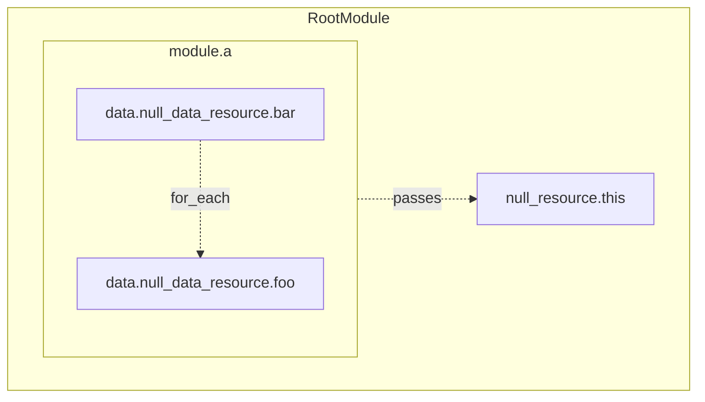

### Project structure

```mermaid
flowchart
  subgraph RootModule
    r1[null_resource.this]
    subgraph module.a
        d1[data.null_data_resource.foo]
        d2[data.null_data_resource.bar]
        d2-.for_each.-> d1
    end
    module.a -.passes.-> r1
  end
```

### Dependency Graph

